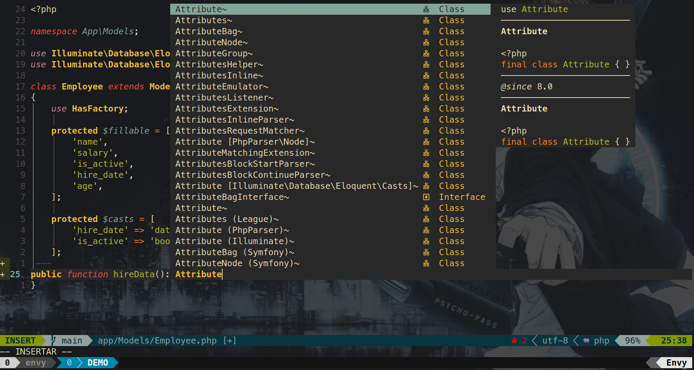
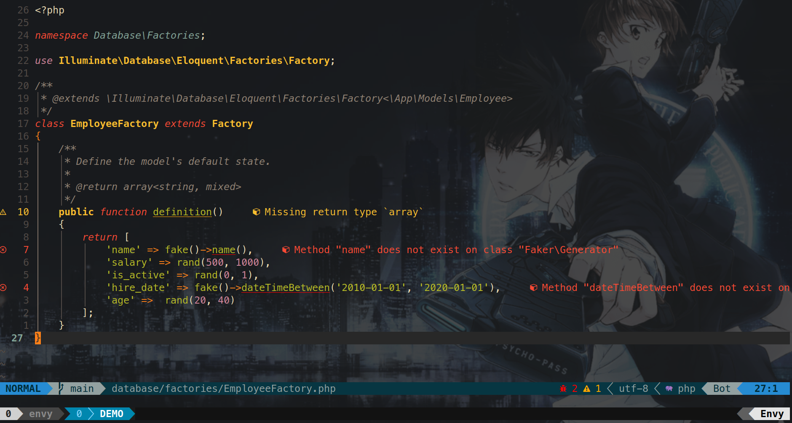
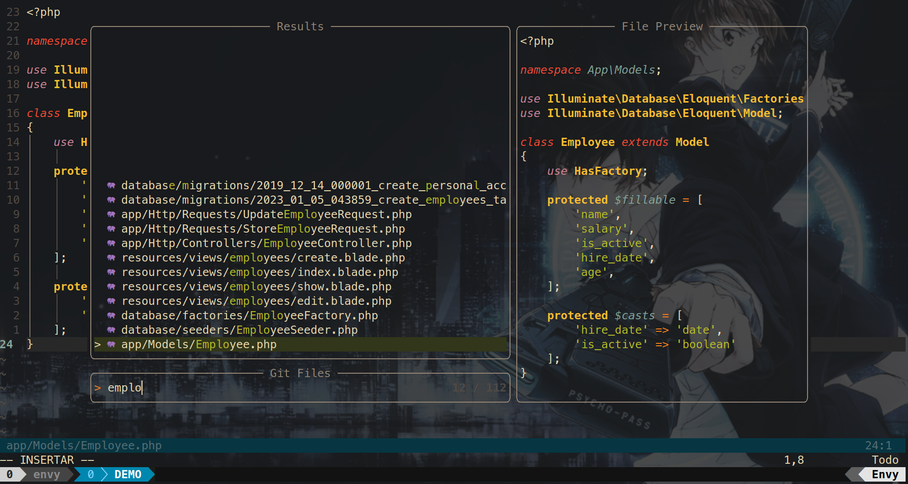
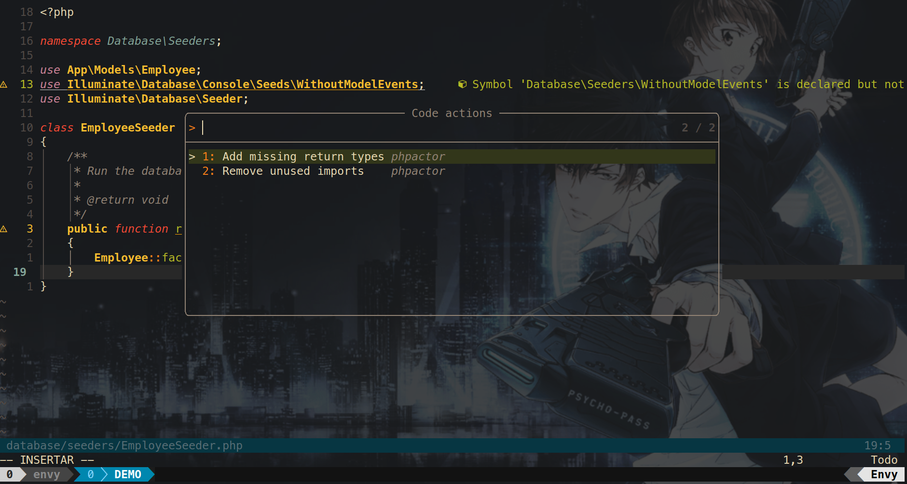

# Code with Luis' Dotfiles

## Table of Contents

<!--toc:start-->
- [Screenshots](#screenshots)
  - [LSP autocomplete](#lsp-autocomplete)
  - [LSP Warning and Errors](#lsp-warning-and-errors)
  - [Telescope Searching Files](#telescope-searching-files)
  - [LSP Code Actions](#lsp-code-actions)
- [Neovim Setup](#neovim-setup)
  - [Neovim Package Manager](#neovim-package-manager)
  - [Neovim Theme](#neovim-theme)
  - [LSP (Diagnostics, Code Actions, Completions, and more)](#lsp-diagnostics-code-actions-completions-and-more)
  - [Sessions](#sessions)
  - [Testing](#testing)
  - [Laravel (PHP Framework)](#laravel-php-framework)
  - [Markdown](#markdown)
  - [Manage Projects](#manage-projects)
  - [Fuzzy Finder](#fuzzy-finder)
  - [GIT Integration](#git-integration)
  - [Tmux Integration](#tmux-integration)
  - [Comments](#comments)
  - [Status Bar](#status-bar)
  - [Utilities](#utilities)
  - [Snippets](#snippets)
- [ZSH](#zsh)
  - [Zsh Plugins](#zsh-plugins)
  - [Zsh Theme](#zsh-theme)
- [Tmux](#tmux)
  - [Tmux Plugin Manager](#tmux-plugin-manager)
  - [Tmux Plugins](#tmux-plugins)
- [About me](#about-me)
<!--toc:end-->

## Screenshots

### LSP autocomplete

### LSP Warning and Errors

### Telescope Searching Files

### LSP Code Actions

## Neovim Setup

Require [Neovim](https://neovim.io/) >=0.8

### Neovim Package Manager

- [wbthomason/packer.nvim](https://github.com/wbthomason/packer.nvim): Plugin Package Manager

### Neovim Theme

- [Murtaza-Udaipurwala/gruvqueen](https://github.com/murtaza-u/gruvqueen): Port of famous gruvbox theme in lua(inspired by gruvbox-material)

### LSP (Diagnostics, Code Actions, Completions, and more)

- [neovim/nvim-lspconfig](https://github.com/neovim/nvim-lspconfig): LSP support for languages like PHP, javascript, and more.

- [williamboman/mason.nvim](https://github.com/williamboman/mason.nvim) Easily install and manage LSP servers, DAP servers, linters, and formatters.

- [williamboman/mason-lspconfig.nvim](https://github.com/williamboman/mason-lspconfig.nvim): Extension to mason.nvim that makes it easier to  -lspconfig with mason.nvim

- [jose-elias-alvarez/null-ls.nvim](https://github.com/jose-elias-alvarez/null-ls.nvim):  -Neovim as a language server to inject LSP diagnostics, code actions, and more via Lua

- [MunifTanjim/prettier.nvim](https://github.com/MunifTanjim/prettier.nvim): Prettier plugin for Neovim's built-in LSP client.

- [glepnir/lspsaga.nvim](https://github.com/glepnir/lspsaga.nvim): A light-weight lsp plugin based on neovim's built-in lsp with a highly performant UI

- [folke/trouble.nvim](https://github.com/folke/trouble.nvim): A pretty diagnostics, references, telescope results, quickfix and location list to help you solve all the trouble your code is causing

- [gbprod/phpactor.nvim](https://github.com/gbprod/phpactor.nvim): Lua version of the Phpactor vim plugin, PHP code actions and more.

### Sessions

- [Shatur/neovim-session-manager](https://github.com/Shatur/neovim-session-manager): A simple wrapper aroud :mksession

### Testing

- [tpope/vim-dispatch](https://github.com/tpope/vim-dispatch): Asynchronous build and test dispatcher

- [vim-test/vim-test](https://github.com/vim-test/vim-test): Run your tests inside Neovim

### Laravel (PHP Framework)

- [noahfrederick/vim-composer](https://github.com/noahfrederick/vim-composer): Vim support for Composer PHP projects

- [noahfrederick/vim-laravel](https://github.com/noahfrederick/vim-laravel): Vim support for Laravel/Lumen projects

- [Kibadda/laravel-docs.nvim](https://github.com/Kibadda/laravel-docs.nvim): A telescope.nvim extension that offers Laravel documentation shortcuts

### Flutter

- [akinsho/flutter-tools.nvim](https://github.com/akinsho/flutter-tools.nvim): Tools to help create flutter apps in neovim using the native lsp
- [dart-lang/dart-vim-plugin](https://github.com/dart-lang/dart-vim-plugin): Syntax highlighting for Dart in Vim
- [Nash0x7E2/awesome-flutter-snippets](https://github.com/Nash0x7E2/awesome-flutter-snippets): Awesome Flutter Snippets is a collection snippets and shortcuts for commonly used Flutter functions and classes

### Markdown

- [iamcco/mardown-preview.nvim](https://github.com/iamcco/markdown-preview.nvim): markdown preview plugin for (neo)vim

### Manage Projects

- [tpope/vim-projectionist](https://github.com/tpope/vim-projectionist): Granular project configuration

- [nvim-treesitter/nvim-treesitter](https://github.com/nvim-treesitter/nvim-treesitter): Nvim Treesitter configurations and abstraction layer

- [nvim-treesitter/playground](https://github.com/nvim-treesitter/playground): View treesitter information directly in Neovim

- [ThePrimeagen/harpoon](https://github.com/ThePrimeagen/harpoon): Working only with the files you really need

### Fuzzy Finder

- [nvim-telescope/telescope.nvim](https://github.com/nvim-telescope/telescope.nvim): Find files and Folders, Filter, Preview, Pick. All lua, all the time.

- [nvim-telescope/telescope-file-browser.nvim](https://github.com/nvim-telescope/telescope-file-browser.nvim): is a file browser extension for telescope.nvim. It supports synchronized creation, deletion, renaming, and moving of files and folders

- [nvim-telescope/telescope-ui-select.nvim](https://github.com/nvim-telescope/telescope-ui-select.nvim): Cool extension for Telescope, it means for example that neovim core stuff can fill the telescope picker like code actions.

### GIT Integration

- [tpope/vim-fugitive](https://github.com/tpope/vim-fugitive): A Git wrapper

- [mhinz/vim-signify](https://github.com/mhinz/vim-signify): show a diff using Vim its sign column.

- [lewis6991/gitsigns.nvim](https://github.com/lewis6991/gitsigns.nvim):  Git integration for buffers

### Tmux Integration

- [aserowy/tmux.nvim](https://github.com/aserowy/tmux.nvim): tmux integration for nvim features pane movement and resizing from within nvim

- [camgraff/telescope-tmux.nvim](https://github.com/camgraff/telescope-tmux.nvim): Integration for tmux with telescope.nvim

### Comments

- [numToStr/Comment.nvim](https://github.com/numToStr/Comment.nvim): Smart and powerful comment plugin for neovim. Supports treesitter, dot repeat, left-right/up-down motions, hooks, and more

- [JoosepAlviste/nvim-ts-context-commentstring](https://github.com/JoosepAlviste/nvim-ts-context-commentstring): Neovim treesitter plugin for setting the commentstring based on the cursor location in a file

### Status Bar

- [nvim-lualine/lualine.nvim](https://github.com/nvim-lualine/lualine.nvim): A blazing fast and easy to configure neovim statusline plugin written in pure lua

### Utilities

- [jiaoshijie/undotree](https://github.com/jiaoshijie/undotree): Manage the undos history

- [windwp/nvim-ts-autotag](https://github.com/windwp/nvim-ts-autotag): treesitter to auto close and auto rename html tag

- [phaazon/hop.nvim](https://github.com/phaazon/hop.nvim): Neovim motions on speed

- [tpope/vim-surround](https://github.com/tpope/vim-surround): Delete/change/add parentheses/quotes/XML-tags/much more with ease

- [tpope/vim-repeat](https://github.com/tpope/vim-repeat): Enable repeating supported plugin maps with "."

- [LunarWatcher/auto-pairs](https://github.com/LunarWatcher/auto-pairs): Vim plugin, insert or delete brackets, parentheses, and quotes in pairs

- [lukas-reineke/indent-blankline.nvim](https://github.com/lukas-reineke/indent-blankline.nvim): Indent guides for Neovim

### Snippets

- [hrsh7th/cmp-vsnip](https://github.com/hrsh7th/cmp-vsnip): nvim-cmp source for vim-vsnip

- [hrsh7th/vim-vsnip](https://github.com/hrsh7th/vim-vsnip): Snippet plugin for vim/nvim that supports LSP/VSCode's snippet format

- [hrsh7th/vim-vsnip-integ](https://github.com/hrsh7th/vim-vsnip-integ): vim-vsnip integrations to other plugins

- [saadparwaiz1/cmp_luasnip](https://github.com/saadparwaiz1/cmp_luasnip): luasnip completion source for nvim-cmp

- [L3MON4D3/LuaSnip](https://github.com/L3MON4D3/LuaSnip): Snippet Engine for Neovim written in Lua.

- [rafamadriz/friendly-snippets](https://github.com/rafamadriz/friendly-snippets): Set of preconfigured snippets for different languages

- [onecentlin/laravel-blade-snippets-vscode](https://github.com/onecentlin/laravel-blade-snippets-vscode): Laravel blade snippets and syntax highlight support for Visual Studio Code

- [onecentlin/laravel5-snippets-vscode](https://github.com/onecentlin/laravel5-snippets-vscode): Laravel snippets for Visual Studio Code (Support Laravel 5 and above)

## ZSH

### Zsh Plugins

- [laravel](https://github.com/ohmyzsh/ohmyzsh/tree/master/plugins/laravel): This plugin adds aliases and autocompletion for Laravel

- [zsh-autosuggestions](https://github.com/zsh-users/zsh-autosuggestions): It suggests commands as you type based on history and completions

- [zsh-syntax-highlighting](https://github.com/zsh-users/zsh-syntax-highlighting): This package provides syntax highlighting for the shell zsh

### Zsh Theme

- [powerlevel10k/powerlevel10k](https://github.com/romkatv/powerlevel10k): Powerlevel10k is a theme for Zsh. It emphasizes speed, flexibility and out-of-the-box experience.

## Tmux

### Tmux Plugin Manager

- [tmux-plugins/tpm](https://github.com/tmux-plugins/tpm)

### Tmux Plugins

- [tmux-plugins/tmux-sensible](https://github.com/tmux-plugins/tmux-sensible)

- [tmux-plugins/tmux-resurrect](ithub.com/tmux-plugins/tmux-resurrect): Persists tmux environment across system restarts

- [tmux-plugins/tmux-sessionist](https://github.com/tmux-plugins/tmux-sessionist): Lightweight tmux utils for manipulating sessions

- [tmux-plugins/tmux-continuum](https://github.com/tmux-plugins/tmux-continuum): Continuous saving of tmux environment. Automatic restore when tmux is started. Automatic tmux start when computer is turned on

- [tmux-plugins/tmux-yank](https://github.com/tmux-plugins/tmux-yank): Tmux plugin for copying to system clipboard. Works on OSX, Linux and Cygwin.

## About me

- I'm Luis Zelaya, I have passion for coding. I'm a web developer, right now focus on Laravel (PHP framework).
- You can check my [Youtube Channel](https://www.youtube.com/channel/UCTzKyvZnQdpiVkBHG_udHFw)
- Contact me: codewithluis_contactame@zohomail.com
